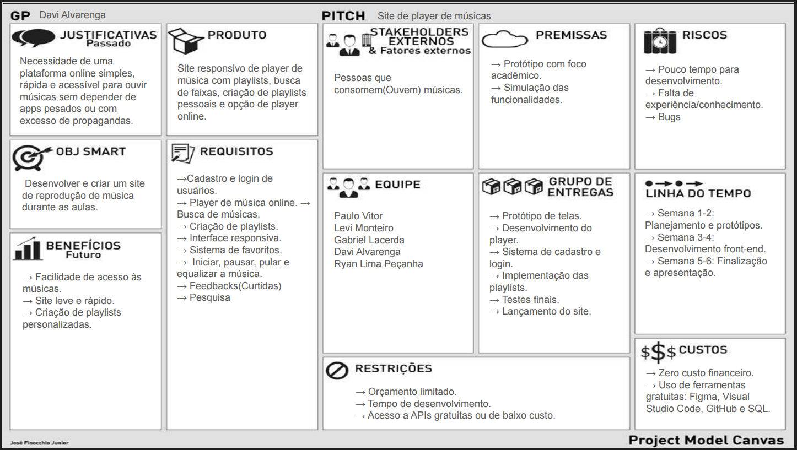
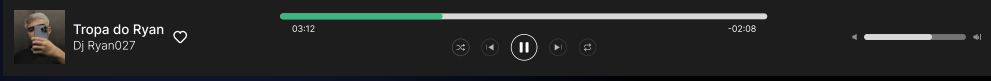
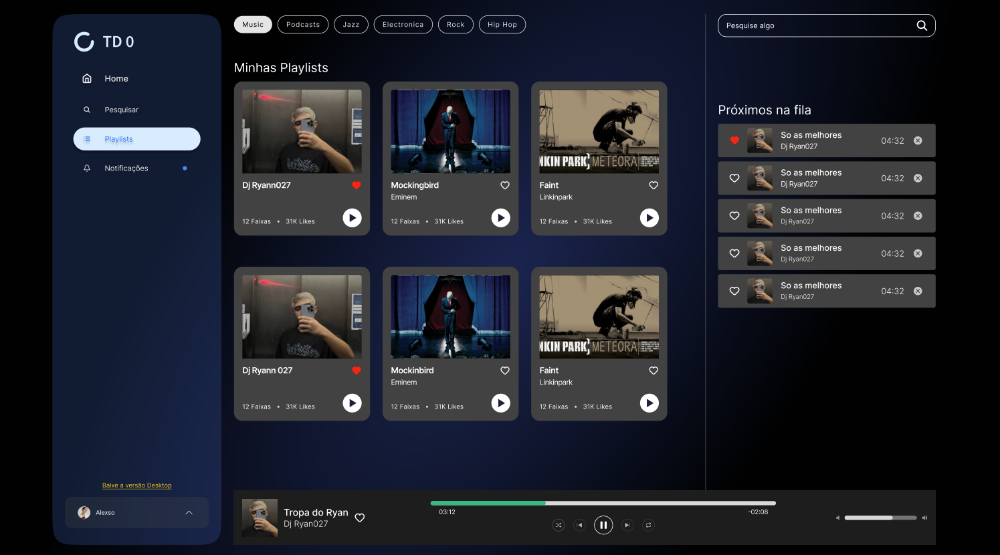
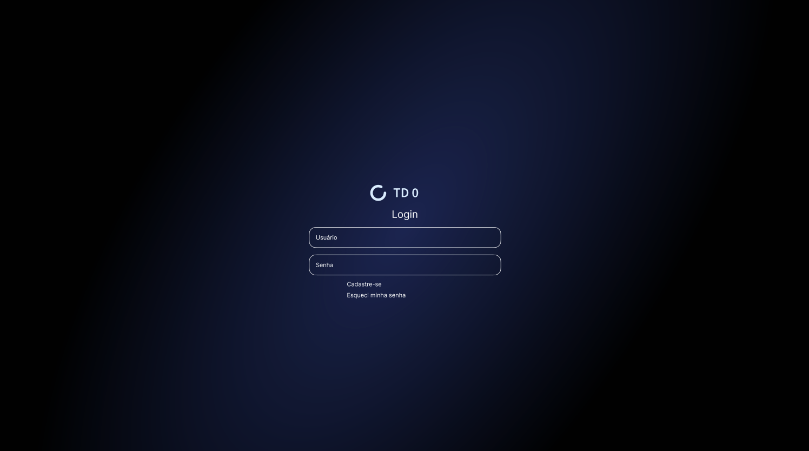
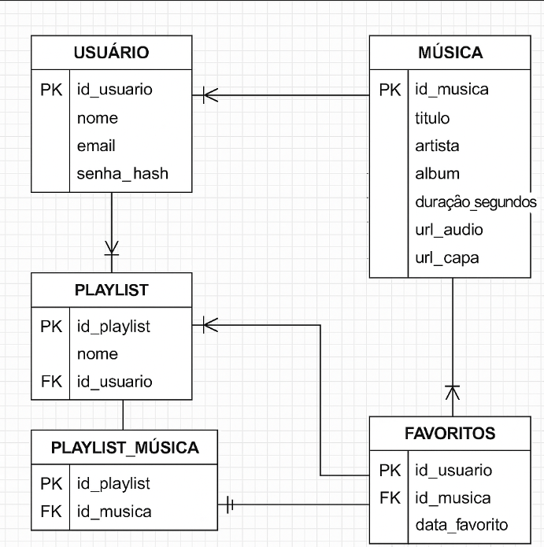

## 📘 Documentação do Projeto - Desenvolvimento Web



## 🧾 Visão Geral

Este projeto visa o desenvolvimento de player de música online. O sistema permite que clientes escutem música, adicionem a playlists, favoritem músicas e acompanhem lançamento dos artistas os quais o segue. A seguir, detalhamos os principais artefatos exigidos para a entrega.

## ✅ Backlog

| ID  | Prioridade | História de Usuário                                                                 |
|-----|------------|--------------------------------------------------------------------------------------|
| ID1   |     1      | Como usuário, eu quero reproduzir músicas para ouvir minhas faixas favoritas.       |
| ID2   |     2      | Como usuário, eu quero ter uma playlist padrão para organizar minhas músicas.       |
| ID3   |     3      | Como usuário, eu quero ver uma barra de progresso com o tempo da música.            |
| ID4   |     4      | Como usuário, eu quero criar playlists personalizadas para organizar minhas músicas.|
| ID5   |     5      | Como usuário, eu quero buscar músicas dentro da playlist para encontrá-las rápido.  |
| ID6   |     6      | Como usuário, eu quero me cadastrar e fazer login para acessar minhas playlists.    |
| ID7   |     7      | Como usuário, eu quero favoritar músicas para acessá-las facilmente depois.         |
| ID8   |     8      | Como usuário, eu quero usar shuffle e repetição para variar ou repetir músicas.     |
| ID9   |     9      | Como usuário, eu quero integrar com APIs externas como Spotify para mais opções.    |
| ID10  |    10      | Como usuário, eu quero controlar o volume para ajustar o som conforme minha preferência. |

## 🎨 Protótipo de Telas

Cada funcionalidade descrita no backlog possui ao menos uma tela representando sua interface esperada.

### 🖼️ Protótipo do Requisito ID1
---
**Figura 1:** Componente responsável por reprodução das faixas (favoritas ou não).



### 🖼️ Protótipo do Requisito ID2
---
**Figura 2:** Tela responsável pelas playlists.



### 🖼️ Protótipo do Requisito ID4
---
**Figura 3:** Tela responsável pelo login.



### ⚠️ Observação
---

Demais histórias de usuários se aplicam em telas já mostrada anteriormente, como por exemplo:

***O botão shuffle e repetição é possível encontrar no mesmo componente da figura 1.***

## ⛓️ Análise e Projeto

O projeto do sistema

**Modelo:**



### 📊 Estrutura de Dados
---
### 🧑 Usuário
---
```json
{
  "id": "u001",
  "nome": "João da Silva",
  "email": "joao@email.com",
  "senhaHash": "********",
  "playlists": ["p001", "p002"],
  "favoritos": ["m003", "m005"]
}
```

### 🎵 Música
---
```
{
  "id": "m001",
  "titulo": "Nome da Música",
  "artista": "Nome do Artista",
  "album": "Nome do Álbum",
  "capaUrl": "https://.../album.jpg",
  "arquivoUrl": "https://.../musica.mp3",
  "duracao": 210
}
```

### 📂 Playlist
---
```
{
  "id": "p001",
  "nome": "Minhas Favoritas",
  "idUsuario": "u001",
  "musicas": ["m001", "m002", "m004"]
}
```

### ❤️ Favoritos 
---
```
{
  "idUsuario": "u001",
  "musicasFavoritas": ["m001", "m004"]
}
```


### 🔐 Autorização e Autenticação

---

### 1.1. Usuários Públicos (Frontend/API Pública)

**Descrição:**  
Usuários que se cadastram ou fazem login no sistema de música (app ou site).

**Mecanismo:**
- Cadastro/Login via endpoints públicos (`/auth/local/register`, `/auth/local`).
- Recebem **JWT (JSON Web Token)** válido após autenticação.
- O JWT é utilizado nos headers (`Authorization: Bearer <token>`) para acesso a rotas protegidas.

**Exemplo de Payload no JWT:**
```json
{
  "id": 23,
  "username": "joaodasilva",
  "email": "joao@example.com",
  "role": "Authenticated",
  "iat": 1716900000,
  "exp": 1717504800
}
```

### 1.2. Usuários Administrativos (Backoffice/Admin Panel)
**Descrição:**  
Usuários que gerenciam conteúdo (músicas, artistas, playlists) e configurações via o painel administrativo do Strapi.

**Mecanismo:**
- Login via painel /admin.
- Sessão autenticada com cookies ou token específico de administrador.
- Gestão de permissões feita diretamente no Admin Panel do Strapi.

### ✅ Autorização
### 2.1. Perfis e Permissões
Contexto de API Pública (Usuários Autenticados):

|Role   | Permissões Típicas
--------|-------------------------------
|Public |	Ler conteúdo público (músicas gratuitas, home, etc.)
|Authenticated|	Criar playlists, curtir músicas, seguir artistas
|Premium|	Acesso a músicas exclusivas, download, qualidade HD

### Contexto de Usuários Administrativos:

|Função|Permissões Típicas
|------|-----------------------------------------------------------
Admin|	Acesso total ao painel, incluindo configurações de roles
Content| Manager	Gerenciar músicas, artistas, álbuns
Support	|Visualizar dados de usuários, sem editar conteúdo

### 👨‍💻 Tecnologias a serem utilizadas:
---

Angular, NodeJS, HTML, CSS, TS, JS...